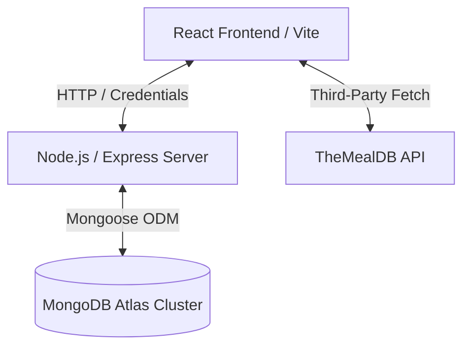

# 🍽️ CraveCart E-Commerce Platform

A premium full-stack e-commerce web application featuring user authentication, shopping cart, interactive meal exploration, custom category navigation, and autocomplete search suggestions. This project integrates the [TheMealDB API](https://www.themealdb.com/api.php) and is powered by a React frontend and a Node.js/Express/MongoDB backend.

---

## 🛠️ Architecture Overview

The application follows a decoupled client-server architecture:



- **Frontend ([client](./client))**: Built with React, Redux Toolkit, Tailwind CSS, Sass, Axios, and React Router. It connects to both the custom backend API and directly to the external TheMealDB API for meal data.
- **Backend ([server](./server))**: Built using Express, Node.js, Mongoose (MongoDB ODM), JWT auth, and Cookie-Parser. It manages stateful features such as user profiles, carts, order tracking, and cached categories.

---

## 📂 Repository Structure

Below is the high-level layout of the project workspace:

```
CraveCart/
├── client/              # React frontend (Vite setup)
│   ├── src/
│   │   ├── api/         # API configurations (Axios base URL, custom endpoints)
│   │   ├── components/  # Reusable UI components & pages
│   │   ├── Redux/       # Redux Toolkit store & slices
│   │   └── scss/        # Custom styling with SASS
│   └── package.json
│
└── server/              # Express backend API
    ├── connection/      # MongoDB connection initializer
    ├── controller/      # API controller actions (users, meals, cart, categories)
    ├── middleware/      # Auth security filters & handlers
    ├── model/           # Mongoose schemas (User, Cart, Meal, Category)
    ├── routes/          # Express route definitions
    └── package.json
```

---

## 🚀 Getting Started

### Prerequisites
Make sure you have the following installed on your machine:
- [Node.js](https://nodejs.org/) (v16+ recommended)
- [npm](https://www.npmjs.com/) (usually bundled with Node.js)
- A MongoDB cluster or running local MongoDB server instance.

---

### Step-by-Step Setup

#### 1. Configure Environment Variables
You need to set up environment configurations for both the backend and frontend components.

- **For Backend Server**:
  Create a `.env` file in the [server](./server) folder:
  ```env
  PORT=8000
  MONGO_USER=your_mongodb_username
  MONGO_PASS=your_mongodb_password
  JSONKEY=your_jwt_secret_key
  ```

- **For Frontend Client**:
  Create a `.env` file in the [client](./client) folder:
  ```env
  VITE_APP_BACKEND_URL=http://localhost:8000
  ```

---

### 💻 Running the Application

To run the application locally, you must start both the backend server and frontend development server.

#### Option A: Running Server First
1. Open a new terminal in the [server](./server) folder:
   ```bash
   cd server
   npm install
   npm start
   ```
   > [!NOTE]
   > The server will start and output `mongoDb is connected` and `listening on PORT : 8000` when successful.

#### Option B: Running Client Second
2. Open another terminal in the [client](./client) folder:
   ```bash
   cd client
   npm install
   npm run dev
   ```
   > [!TIP]
   > The frontend development server will spin up on `http://localhost:5173`. Open your web browser to start shopping!

---

## 🔒 Security & CORS configuration
The backend server uses strict CORS configurations to protect session data. Credentials and cookies are enabled via:
- `credentials: true`
- Explicit origins targeting `http://localhost:5173` (configured dynamically or in the main server file).

See the [Server Documentation](./server/README.md) and [Client Documentation](./client/README.md) files for sub-component specific architecture, dependencies, and API endpoints.
